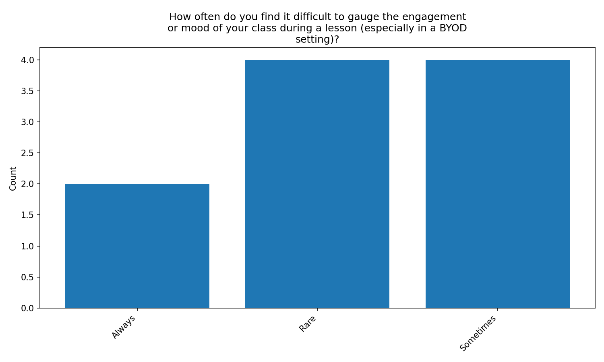
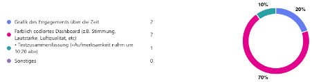
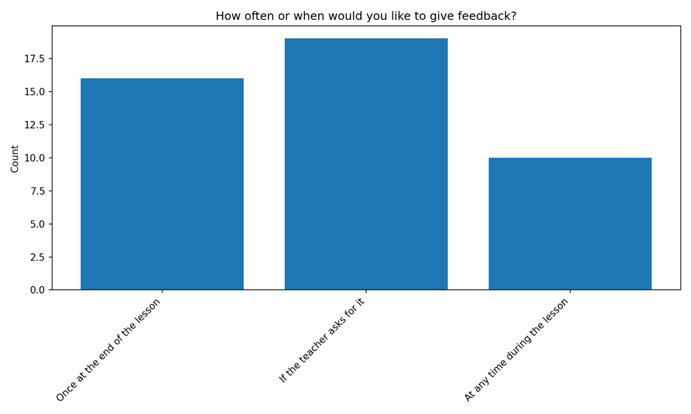
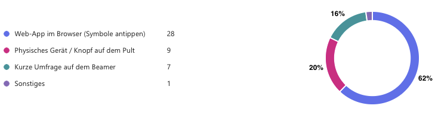

Before building prototypes, we conducted an exploratory study to understand needs and concerns around classroom climate 
monitoring in BYOD lessons. This phase informed the functional requirements and the “tone” of the user interface.

## Participants (exploratory study)

We surveyed 10 practising teachers and 45 students from a Swiss Gymnasium (Gymnasium St. Klemens in Ebikon LU). Follow-up 
interviews were conducted with a subset of three teachers and three students.

## Instruments and procedure

- Two online questionnaires (teachers + students) implemented in Microsoft Forms.
- Six semi-structured interviews (approximately 20 minutes), audio-recorded and transcribed.

Teacher questions focused on: how hard it is to judge engagement behind laptops, whether real-time feedback would help, 
preferred visualisations, attitudes towards environmental indicators, and privacy concerns.

Student questions focused on: willingness to report mood/focus, preferred input style, acceptable frequency/timing, and 
concerns about anonymity and surveillance-like features (tracking, cameras).

## Data analysis

Survey results were analysed descriptively. Open responses and interviews were thematically coded, leading to themes 
such as “visibility of engagement”, “anonymity and trust”, “interaction effort”, and “calm visual style”.

## Key findings

### Teacher perspective

Teachers confirmed that judging class engagement with open devices is challenging. Sixty percent reported that it is at 
least sometimes difficult to read the class state in BYOD settings.

They also preferred an aggregated view rather than individual-level tracking, and asked for clear, simple visualisations 
(e.g., bars / percentages).

### Student perspective

Students were generally willing to provide feedback sometimes, but not continuously, and strongly required anonymity. 
They preferred a minimal, “background” interaction (fast taps, no typing, no full-screen overlays).

### Qualitative style guidance

Both groups emphasised trust and low effort. Teachers wanted the interface to blend into existing routines rather than 
compete for attention. Students wanted something “small, calm, and optional”, and they linked their willingness to 
participate to visible teacher reactions (e.g., pausing, clarifying, changing pace).

## Design consequences

The exploratory study led to these core design decisions:

- Anonymous one-tap student input with four central states (OK/continue, too fast/confused, overloaded/need break, tired/low energy).
- Aggregated class-climate visualisation for teachers (no identities, no individual histories).
- A teacher view designed for peripheral awareness (browser sidebar or external display).
- Optional environment indicators at room level only (noise/temperature/CO$_2$), not tied to individuals.
