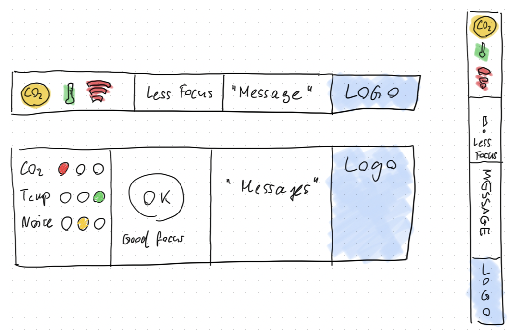
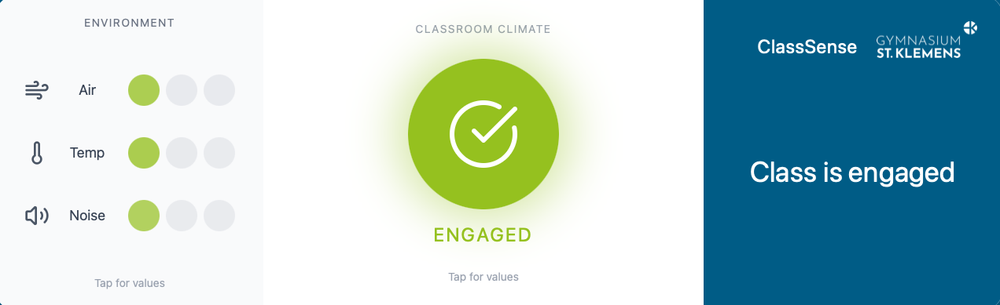
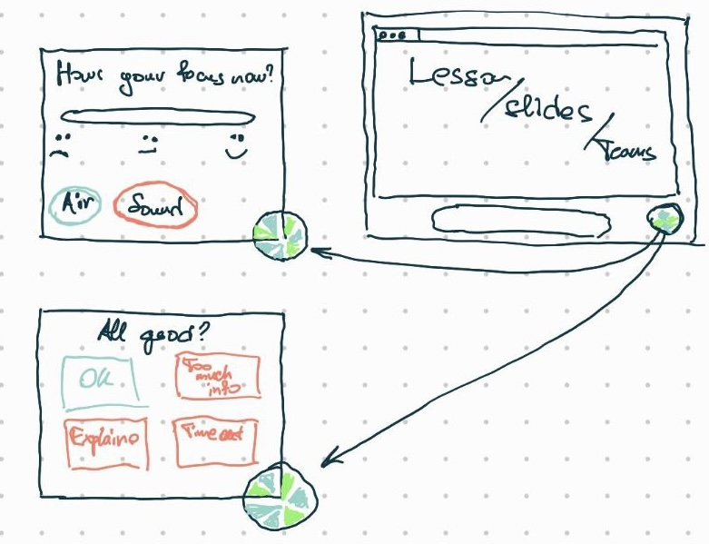
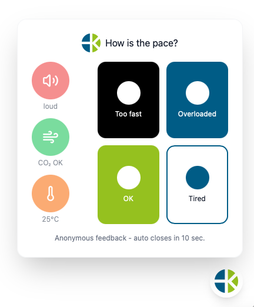

We iterated from paper sketches to interactive Figma prototypes and then built a lightweight functional prototype to validate feasibility.

## Teacher prototype

We created two dashboard layouts: a compact status bar and a full-screen dashboard. We started with paper sketches to test visual hierarchy and information density.

We then implemented interactive Figma prototypes so teachers could evaluate readability, colour coding, and density in a more realistic setting.

## Student prototype

Two interaction variants were developed:

- **Buttons:** one-tap input for four states (OK, confused, overloaded, tired).
- **Sliders:** more nuanced expression, but higher precision and attention demands.

We first sketched both concepts as paper prototypes.

Then we implemented both variants in Figma to validate tap targets, layout, and visual calmness.

