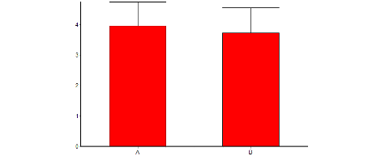
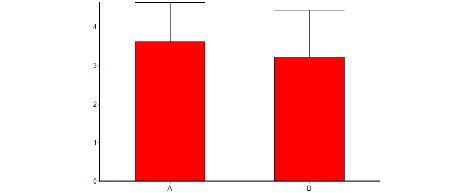
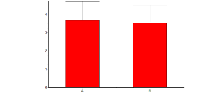
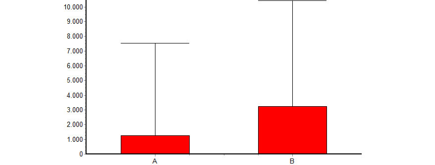
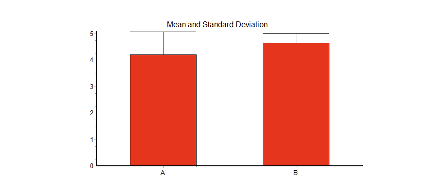
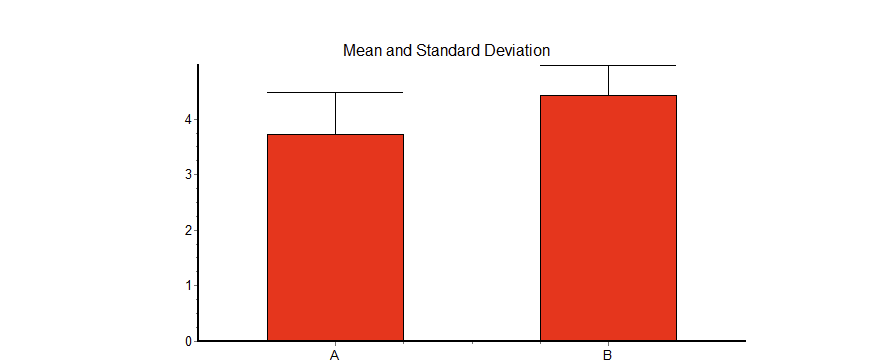

## Student UI: buttons vs. sliders

### Usability

A paired-samples t-test indicated no statistically significant difference between buttons (M = 3.76, SD = 1.13) and sliders (M = 3.68, SD = 1.00), t(25) = 0.46, p = 0.65.

### Disruption during class

Because disruption ratings were not normally distributed, a Wilcoxon matched-pairs signed-rank test was applied. No significant difference was found between buttons (M = 3.60, SD = 1.02) and sliders (M = 3.23, SD = 1.21), p = 0.152.

### Adoption intention

Using a Wilcoxon test (non-normal distributions), no significant difference emerged between buttons (M = 3.69, SD = 1.03) and sliders (M = 3.54, SD = 0.98), p = 0.34.

### Reaction time

Reaction-time traces showed a clear efficiency advantage for buttons. Because distributions deviated from normality and observation counts differed (buttons: n = 516, sliders: n = 89), we used a Mann–Whitney U test. Students reacted significantly faster with buttons (Mdn = 80 ms) than with sliders (Mdn = 514 ms), U = 11576, p < 0.0001.

### Preference

Despite similar Likert ratings, forced choice showed a clear preference: 19/26 students preferred buttons (binomial test p = .040). Button supporters described the interaction as faster and less distracting, while slider supporters valued precision.

## Teacher dashboard: browser vs. external screen

### Usability

Teachers reported high usability for both variants. A paired-samples t-test indicated no significant difference between browser (M = 4.21, SD = 0.86) and external screen (M = 4.64, SD = 0.38), t(6) = 1.35, p = 0.225.

### Practicality / disruption

Using a Wilcoxon test (non-normal distribution), no significant difference was found between browser (M = 3.71, SD = 0.76) and external screen (M = 4.43, SD = 0.53), p = 0.25.

### Adoption intention

Adoption intention also showed no significant difference (Wilcoxon, p = 0.25), but the external screen trended higher: browser (M = 3.86, SD = 0.63) vs. external screen (M = 4.36, SD = 0.48).

### Preference

Forced choice revealed a strong preference: 6/7 teachers chose the external-screen dashboard. Teachers reported that an additional screen avoids window switching, keeps teaching materials visible, and supports continuous peripheral awareness.

## Discussion and implications

Across both groups, the dominant theme was *low effort + high trust*. Students reacted significantly faster with one-tap buttons, supporting the central design principle that in-class feedback must be nearly effortless [@fitts1954information]. Teachers preferred the external-screen setup because it integrates better with real teaching flow and reduces disruptions from task switching [@czerwinski2004diary].

Overall, ClassSense appears feasible and desirable in a BYOD secondary school context—provided it remains anonymous, aggregated, and calm in its visual behaviour.

## Limitations and next steps

- Sample sizes were modest (n = 26 students, n = 7 teachers) and sessions were short, limiting generalisability and long-term adoption claims.
- The evaluation focused on UI comparison; longer deployments are needed to assess habituation effects and real classroom impact.
- Future iterations should refine accessibility beyond colour choices (icons, text alternatives) and evaluate whether environment indicators meaningfully improve teaching decisions.
